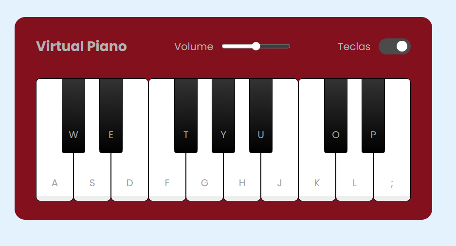

# 🎹 Virtual Piano

Um piano virtual interativo feito com **HTML**, **CSS** e **JavaScript** puros. A aplicação simula um teclado musical que pode ser tocado tanto com o **mouse** quanto com **teclas reais do teclado**, além de permitir o ajuste de volume e exibir ou ocultar os atalhos das teclas.

## 🎯 Objetivo

📌 Este projeto foi desenvolvido como **exercício prático de aula**, com base no conteúdo do **Bootcamp de Front-End**.  
O objetivo é aplicar os conhecimentos em **HTML**, **CSS** e **JavaScript**, com foco principal na **manipulação do DOM** e **interações em tempo real com o usuário**.

## 🧠 Conceitos aplicados

- **DOM Manipulation:** uso de `querySelector`, `addEventListener`, e `classList` para controlar comportamento dinâmico dos elementos HTML.
- **Eventos de teclado e clique:** interação com teclas físicas (via `keydown`) e com cliques nas teclas visuais (`click`).
- **Método `classList.toggle`:** usado para alternar dinamicamente a visibilidade das letras nas teclas, ativando ou desativando a classe `.hide`.
- **Controle de volume com `input[type="range"]`:** permite ao usuário ajustar a intensidade do som reproduzido em tempo real.
- **Estilização com pseudo-elementos (`::before`):** usado para criar o botão deslizante do `checkbox` estilizado (interruptor de mostrar/esconder teclas), sem precisar de elementos extras no HTML.
- **Componentes customizados:** implementação de `checkbox slider` estilizado com CSS puro e pseudo-elementos.
- **Estilo responsivo com `flexbox`:** usado para alinhar e distribuir elementos como o header e as teclas do piano de forma eficiente.

## 🖼️ Prévia

## 📎 Créditos

Projeto original fornecido pela [Digital Innovation One (DIO)](https://dio.me).

Desenvolvimento e adaptações por **Cristiane Machado**.